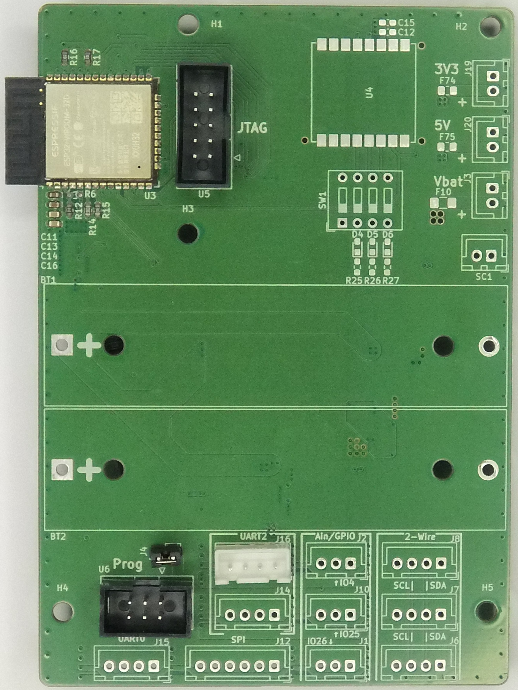
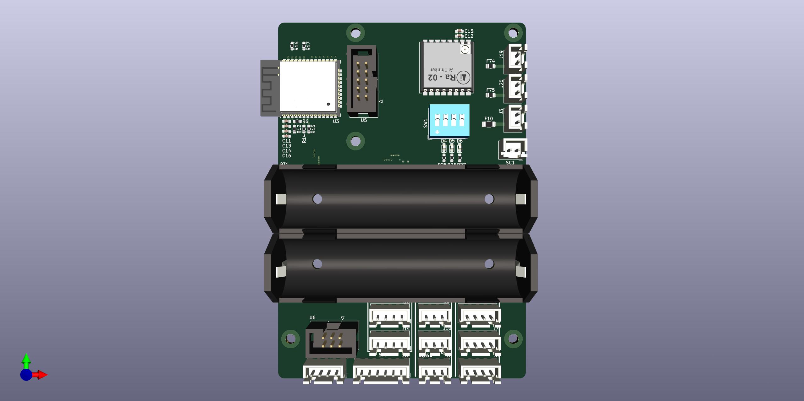
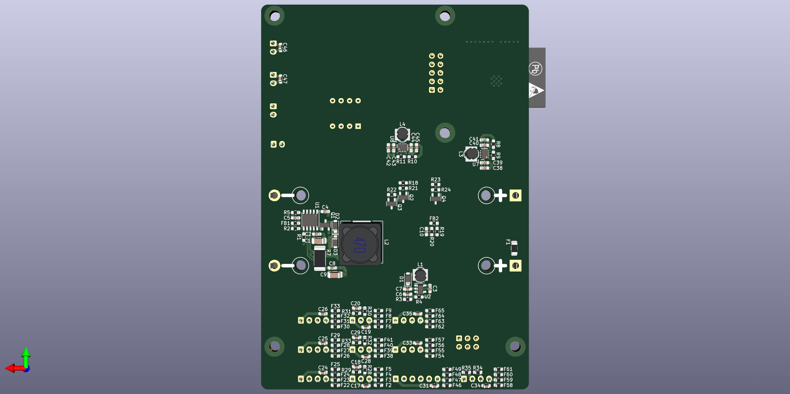

# Wasserpegelmelder

## Übersicht

Der **Wasserpegelmelder** ist ein eigenständiges Überwachungssystem zur Frühwarnung vor Hochwasser. Das Gerät kann an Brücken montiert werden und misst kontinuierlich den Wasserstand des Flusses. Bei Überschreiten kritischer Schwellwerte wird automatisch eine Warnung versendet.

## Funktionsweise

Der Ultraschallsensor JSN-SR04 misst den Abstand vom Sensor zur Wasseroberfläche. Auf Basis dieses Abstands und der Neigung wird der aktuelle Wasserstand berechnet. Das System überwacht dabei:

- **Kritischer Wasserstand**: >=95 cm (Hälfte der Flussbett-Tiefe von 190 cm)
- **Kritischer Anstieg**: entspricht >=95 cm/h

Bei Überschreiten dieser Werte wird eine Warnmeldung per Telegram versendet.

## Hardware

Das System basiert auf einem **ESP32-WROOM-32U** und verfügt über:

| Komponente | Beschreibung |
|------------|--------------|
| JSN-SR04T | Ultraschallsensor für Wasserstandsmessung |
| LoRa Ra-02 | Funkmodul für zusätzliche Langstreckenkommunikation |
| CN3791 MPPT | Solarladeregler für 9V Solarzelle (1,17W) |
| TPS63901 | Buck-Boost Regler für 3,3V |
| TPS63802 | Buck-Boost Regler für 5V |
| 18650 | Akkuhalterungen für Akkubetrieb |

### JSN-SR04T

## Betriebsmodi

### Modus 1 - Messung
Das Gerät führt alle 20 Sekunden Messungen durch und geht zwischen den Messungen in den Deep-Sleep Modus, um Strom zu sparen. Keine WLAN-Verbindung wird hergestellt.

### Modus 2 - Fernsteuerung
Alle 5 Minuten wird eine WLAN-Verbindung hergestellt, um auf eingehende Telegram-Befehle zu prüfen und ggf. zu antworten. Anschließend geht das Gerät wieder in den Deep-Sleep Modus.

## Telegram-Befehle

Das Gerät verfügt über einen integrierten Telegram-Bot mit folgenden Befehlen:

| Befehl | Parameter | Ausgabe |
|--------|-----------|---------|
| `/meldung` | - | Statusbericht mit aktuellem Wasserstand und Anstiegsgeschwindigkeit |
| `/update` | - | Vorbereitung auf Firmware-Update |

Nur Nachrichten von autorisierten User-IDs werden entgegengenommen und beantwortet.

## Energieeffizienz

Durch Deep-Sleep-Modi und das Abschalten von nicht benötigten Spannungsreglern wird der Stromverbrauch minimiert. Das System ist so ausgelegt, dass es durch die Solarzelle und die 18650 Akkus langfristig eigenständig betrieben werden kann.

## Anwendungsbereich

Das System ist für den Einsatz an einer Brücke gedacht:
- Vorwarnung bei steigendem Wasserstand
- Beobachtung von Anstiegsgeschwindigkeiten
- Langzeitüberwachung des Wasserpegels

Die Installation erfolgt einfach am Geländer mit einer Neigung von ca. 45° zum Lot. Dieser Winkel ergibt sich aus dem Streuwinkel des Sensors zzgl. Toleranz.

## 3D Render eines vollbestückten Melders

